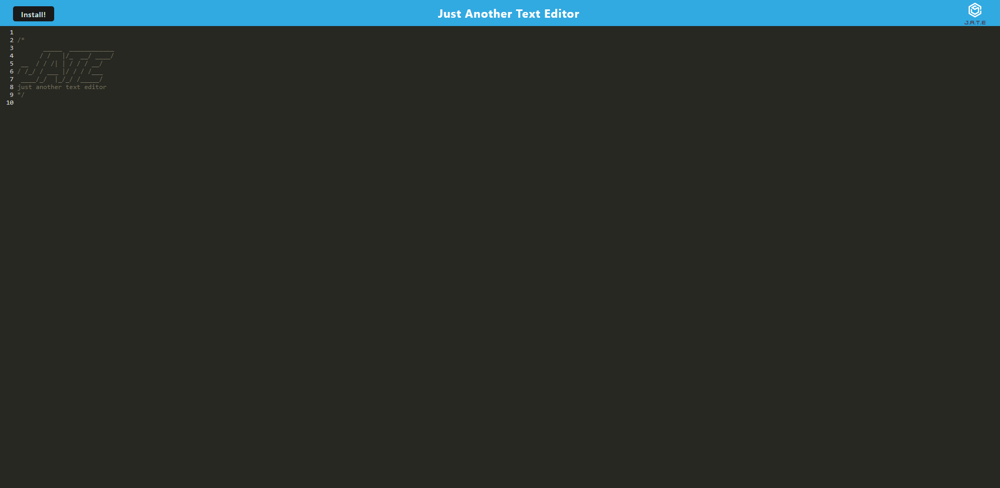

# Progressive Web App: Text Editor 

This assignment was to build a text editor that runs in the browser and feature. a number of data persistence techniques that serve as redundancy in case one of the options is not supported by the browser. The application will also function offline.

## Table of Contents

- [Skills Practiced](#skills-practiced)
- [Installation](#installation)
- [Usage](#usage)
- [Screenshots](#screeenshots)
- [Deployed App](#link-to-deployed-app)
- [Questions](#questions)

## Skills Practiced

- Constructing a progressive web app.
- Using IndexedDB API to save data that persists in the app when offline.
- Using idb to make crud calls to the IndexedDB API.
- Understanding what webpack is doing and how it creates the PWA.
- Clearing the cache and hard reloads to see if errors still persist after edits.
- Deploying to Heroku.

## Installation

If you want to download the app locally follow these steps.

1. Fork the repository
2. Clone the repo locally
3. In the terminal run "npm i" to download the dependencies.
4. Run "npm start" to initiate the app.

## Usage

Allows a user to save and edit text online and offline.

## Screeenshots

## Link to Deployed App

[Deployed App](https://blooming-retreat-74088.herokuapp.com/)

## Questions

If you have any questions about this projects, please contact me directly at mep.summit@gmail.com. You can view more of my projects at https://github.com/peoplesm.
